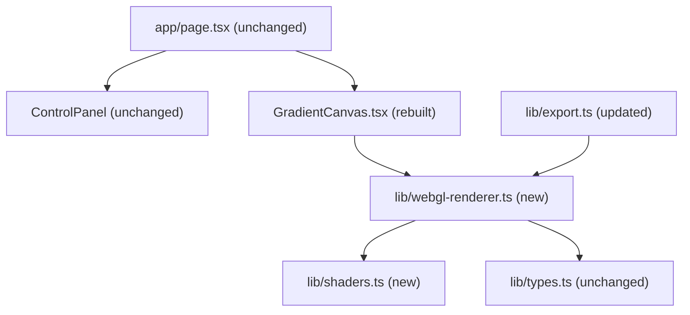

# WebGL + GLSL Mesh Gradient Rebuild

## Why this approach is fundamentally better

The Canvas 2D version draws discrete radial gradient circles and composites them — the blending is an artifact of the compositing mode, not true color interpolation. The WebGL version runs a fragment shader that executes for **every pixel simultaneously on the GPU**, computing a mathematically precise weighted blend of all color points. The result:

- No visible radial falloff artifacts or banding
- Perceptually uniform blending via OKLab color space (colors mix through natural midpoints, not muddy grey)
- Smooth Gaussian falloff per point, gamma-correct sRGB output
- Export at any resolution with zero quality loss

## Architecture

## Shader design

**Vertex shader**: trivial full-screen quad, clips to `[-1, 1]`.

**Fragment shader** — per-pixel computation:

1. For each color point, compute Gaussian weight: `w_i = opacity_i * exp(-d² / (2σ²))` where `σ` maps from the existing `radius` field
2. Sum weighted colors in **OKLab** space (encoded in the shader as a mat3 conversion from linear RGB)
3. Blend the result with the background color based on total weight
4. Apply sRGB gamma correction on output

Max 16 uniform color points — well above the current UI cap of 8.

## Files

### New files

- `lib/shaders.ts` — GLSL vertex + fragment shader source as template literals
- `lib/webgl-renderer.ts` — `WebGLGradientRenderer` class: initializes WebGL context, compiles shaders, manages uniform uploads, exposes `render(config)` and `destroy()`

### Rebuilt files

- `components/GradientCanvas.tsx` — replaces `renderGradient` calls with `WebGLGradientRenderer`. The gradient renders into a WebGL canvas. Drag handles become **absolutely positioned HTML `div` elements** layered on top — no more drawing handles onto the gradient canvas (cleaner separation, easier to style)
- `lib/gradient-renderer.ts` — removed (functionality moved into the WebGL renderer; export path updated)

### Updated files

- `lib/export.ts` — PNG export now calls `canvas.toBlob()` directly on the WebGL canvas (requires `preserveDrawingBuffer: true` on context creation). SVG/CSS/JSON exports remain as-is (they are already approximations)

### Unchanged files

- `app/page.tsx`, `lib/types.ts`, `lib/presets.ts`, `lib/color-utils.ts`
- All control panel components: `ControlPanel.tsx`, `PointEditor.tsx`, `PresetSelector.tsx`, `ExportPanel.tsx`, `HexInput.tsx`, `Slider.tsx`

## Key implementation detail: OKLab blending

Standard RGB blending produces perceptually wrong midpoints (e.g. red + blue → dark muddy purple). OKLab blending is computed inline in the fragment shader via two matrix multiplications — no additional library or texture lookup needed. The result is the same organic, luminosity-preserving color flow seen in high-end design tools.
